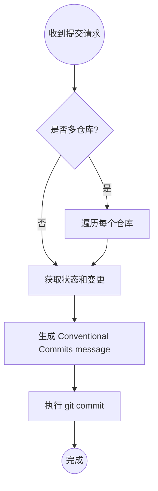

# git-commit

自动分析代码变更并生成符合 Conventional Commits message，然后执行 git commit。

## 触发条件

- 用户明确要求提交变更（"帮我提交", "commit these changes"）
- 用户要求生成或改写 commit message
- 用户要求按规范格式化提交信息

## 核心流程




## Conventional Commits message 规范

**格式:** `type(scope): subject`

| 元素 | 规则 |
|------|------|
| type | 英文：feat/fix/refactor/chore/docs/style/test |
| scope | 英文：模块名或功能域，可选 |
| subject | **简体中文**，动宾结构，无结尾标点 |

**示例:**
- `feat(approval): 支持 rejectReason 和 failReason 字段展示`
- `fix(auth): 修复 token 刷新失败问题`
- `refactor(api): 简化请求重试逻辑`
- `chore(build): 调整构建配置`

## 输出规则

1. **技术标识符保留原文:** 变量名、字段名、API名称、配置项不翻译
2. **自然表达:** 避免生硬直译，使用自然的中文工程表达
3. **简洁明确:** 一行描述变更目的，不加解释或前后缀
4. **类型推断:** 用户未指定 type/scope 时，根据 diff 内容推断

## 多仓库处理

项目可能包含多个 git 仓库（如 client/server 分离），需要：

1. 检测当前工作目录下的所有 git 仓库
2. 对每个有变更的仓库分别执行提交流程
3. 在 commit message 前说明正在处理的仓库

## 提交执行

**安全检查:**
- 使用 `git add <file>` 指定文件，禁止 `git add -A`
- 检查是否包含敏感文件（.env, credentials 等）

**提交格式:**
```bash
git commit -m "feat(scope): 中文描述"
```

**验证:**
- 提交后运行 `git status` 确认成功
- 多仓库时依次处理

## Red Flags - 暂停并确认

- 变更包含 `.env`、`credentials`、密钥文件
- 用户未明确要求提交但检测到变更
- `git push` 操作（需要用户确认）
- `--force`、`--hard` 等破坏性操作

## 示例场景

**单仓库:**
```
用户: 帮我提交这些变更
你: 正在检查变更...
    [分析 diff 内容]
    生成 commit message: feat(approval): 支持 rejectReason 和 failReason 字段展示
    执行 git commit...
    ✓ 提交成功
```

**多仓库:**
```
用户: 提交代码
你: 检测到 2 个仓库有变更:

    1. open-miniprogram-client
       feat(approval): 添加审批状态原因 Tooltip 展示

    2. open-miniprogram-server
       feat(approval): 支持 rejectReason 和 failReason 字段存储与查询

    正在依次提交...
```